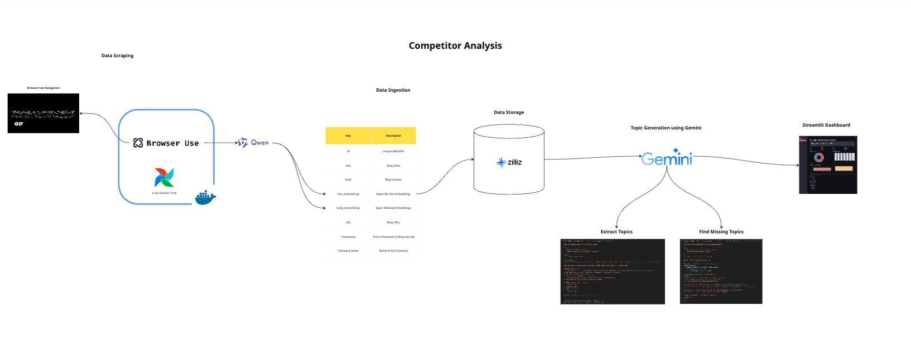

# Competitor-Analysis
## Introduction

This project delivers an **end-to-end competitive intelligence and analytics platform** that automates the discovery, processing, and visualization of competitor activity across multiple digital channels. By combining modern LLMs, vector databases, and autonomous browsing agents, the system enables real-time benchmarking, entity discovery, and strategic content analysis.

## Overview

The platform integrates several core components:

- **Autonomous Data Collection**: A browser agent (powered by [Browser Use](https://github.com/browser-use/browser-use)) navigates competitor websites, newsletters, and social media feeds to detect and retrieve new content automatically.  
- **Text Embedding & Storage**: Unstructured blog data is vectorized using **Qwen-8B embeddings** and stored in **Zilliz VectorDB** for efficient semantic search and retrieval.  
- **Entity & Topic Analysis**: Applied **Named Entity Recognition (NER)** and unsupervised clustering to uncover related entities and perform **gap analysis**; enhanced with **Google Gemini** for advanced topic detection on newly ingested competitor content.  
- **Real-Time Insights Dashboard**: A **Streamlit-based KPI dashboard** aggregates and visualizes competitor activity, highlighting emerging trends, benchmarking metrics, and actionable gaps.  

Together, these components form a unified analytics pipeline that empowers businesses to **monitor competitors dynamically, detect opportunities early, and make data-driven strategic decisions**.

## 📕 Architecture



## 📂 Project Structure
    .
    └── Root
        ├── zilliz_api        # Core API code
        │   ├── db_dump.py    # Vectorizes input data and injects into Milvus
        │   └── example.py    # Toy example inserting blog data into Milvus
        ├── streamlit_app     # streamlit competitor analysis dashboard
        ├── data_adapter      # Data scrapping and ingestion module
        ├── requirements.txt  # Python dependencies
        ├── .env              # Environment variables (HF + Zilliz credentials)
        ├── .devcontainer     # Setup container for data_adapter
        └── README.md         # Project documentation

## 🚀 Getting Started
### 1. Clone the repository
```bash
git clone https://github.com/prabhumane93/competitor-analysis.git
```

### 2. Create and activate a virtual environment
```bash
uv venv --python 3.11  
# python3 -m venv venv
source venv/bin/activate   # macOS/Linux
venv\Scripts\activate      # Windows
```

### 3. Install dependencies
```bash
uv pip install -r requirements.txt
```

### 4. Configure environment variables
Create a .env file in the project root with your Milvus/Zilliz settings:
```bash
HF_TOKEN="your_huggingface_token"
MILVUS_URI="your-milvus-instance-uri"
MILVUS_TOKEN="your-api-key-or-token"
COLLECTION_NAME="your_collection_name"

GOOGLE_API_KEY="your-gemini-api-key"
```

### 5. Setup Airflow
Follow instructions on Airflow quickstart : https://airflow.apache.org/docs/apache-airflow/stable/start.html

## For Data Ingestion
### Open in Dev Container

VS Code detects the `.devcontainer` folder and will suggest reopening in a container.  
If not, follow these steps:

1. Press **Ctrl + Shift + P** (or **Cmd + Shift + P** on macOS).  
2. Search for:  Dev Containers: Reopen in Container


## For Streamlit Dashboard
### Go to streamlit_app
```bash
cd streamlit_app
```
### Next, proceed with the steps outlined in the enclosing README in streamlit_app folder.

